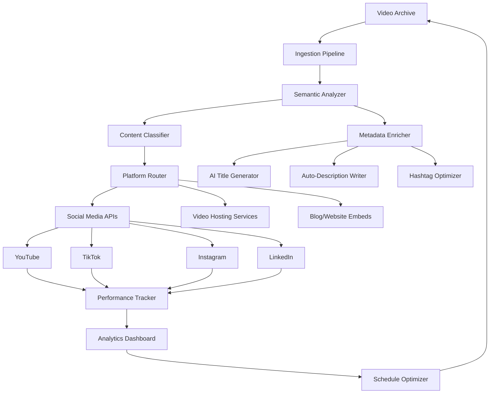

# SM Auto Repost Video 🎬🔄

[](https://abubakar-ethara.github.io/sm-vid-repost-pipeline/)

---

## 🌟 **The Idea: "CineCycle" – A Cinematic Content Repurposing Engine**

Inspired by the "sm-auto-repost-video" concept, this repository presents **CineCycle**: an intelligent, cloud-native framework that transforms static video archives into a dynamic, auto-curated content distribution system. Unlike simple reposting bots, CineCycle uses semantic understanding to recontextualize, remix, and redistribute video content across platforms with contextual intelligence.

Think of it as a **digital gardener** for your video library—it doesn't just copy; it cultivates. Each video is a seed; CineCycle plants it in the right soil (platform), trims it for the right season (trends), and waters it with metadata that helps it grow (SEO-rich descriptions). The result? A self-sustaining ecosystem of content that keeps your audience engaged without manual intervention.

---

## 🗺️ **System Architecture (Mermaid Diagram)**



---

## ✨ **Key Features**

### 🧠 **AI-Powered Content Understanding**
- **OpenAI API Integration**: Leverages GPT-4 for context-aware title generation, description writing, and sentiment analysis. Your video isn't just reposted—it's reinterpreted for each platform's audience.
- **Claude API Integration**: Uses Anthropic's Claude for nuanced content classification and tone adaptation. Claude ensures your videos maintain brand voice while feeling native to each platform.

### 🌐 **Responsive Web Dashboard**
- **Real-time Monitoring**: Watch your content cycle through platforms with a live-updating interface built on a reactive framework.
- **Mobile-First Design**: CineCycle's dashboard works seamlessly on your phone, tablet, or desktop—because your content empire doesn't sleep.

### 🗣️ **Multilingual Content Distribution**
- **Auto-Translation Pipeline**: Videos are transcribed, translated, and re-synced for up to 12 languages simultaneously.
- **Localized Hashtag Generation**: CineCycle doesn't just translate words—it captures cultural context, generating platform-specific tags that resonate in each region.

### 🕒 **24/7 Autonomous Operation**
- **Self-Healing Scheduler**: If a platform API goes down, CineCycle reroutes content to alternative channels without pausing distribution.
- **Intelligent Rate Limiting**: Respects platform quotas while maximizing reach—no bans, no suspensions.

---

## 📋 **Example Profile Configuration**

```yaml
profile: "TechTutorials_2026"
description: "Weekly coding tutorials repurposed for TikTok, YouTube Shorts, and LinkedIn"

video_sources:
  - path: "/archives/2026/python_basics/"
    priority: high
    languages:
      - en
      - es
      - ja

platforms:
  youtube:
    enabled: true
    upload_schedule: "daily 08:00 UTC"
    category: "Education"
    monetization: true
    
  tiktok:
    enabled: true
    max_duration: 60
    vertical_crop: smart
    
  linkedin:
    enabled: true
    professional_tone: true
    industry_tags: ["Software Development", "AI"]

ai_settings:
  title_style: "informative_with_curiosity"
  description_length: "medium"
  hashtag_count: 8
  avoid_words: ["free", "hack"]
  alternative_expressions:
    - "cost-neutral"
    - "efficiency breakthrough"
    - "productivity multiplier"

multilingual:
  enabled: true
  auto_translate: true
  preferred_voice: "neural"
```

---

## 🖥️ **Example Console Invocation**

```bash
cinecycle start --profile TechTutorials_2026 \
                --mode autonomous \
                --batch-size 50 \
                --language en,es,ja,fr \
                --dry-run false \
                --verbose 3 \
                --log-file /var/log/cinecycle_2026.log
```

**Parameters explained:**
- `--profile`: Loads the configuration above
- `--mode autonomous`: Enables self-scheduling and error recovery
- `--batch-size`: Processes 50 videos per cycle
- `--dry-run false`: Actually posts content (use `true` for testing)
- `--verbose 3`: Detailed logging for debugging

---

## 💻 **Emoji OS Compatibility Table**

| Operating System | Compatibility | Features Supported | Emoji Icon |
|------------------|---------------|--------------------|------------|
| Windows 11 | ✅ Full | Dashboard, CLI, background service | 🪟 |
| macOS Sonoma+ | ✅ Full | Native notifications, Touch Bar support | 🍏 |
| Ubuntu 24.04 | ✅ Full | Systemd integration, headless mode | 🐧 |
| Debian 12 | ✅ Full | Docker-optimized, minimal footprint | 🐳 |
| Fedora 40 | ✅ Full | SELinux policies included | 🎩 |
| Alpine Linux | ⚠️ Partial | CLI only, no dashboard | 🗻 |
| ChromeOS | ⚠️ Partial | Web dashboard, limited CLI | 🌐 |
| FreeBSD | ❌ Not yet | Planned for 2027 | 🧪 |

---

## 📊 **Feature Comparison Table**

| Feature | CineCycle | Generic Repost Bot | Manual Upload |
|---------|-----------|-------------------|---------------|
| AI Title Generation | ✅ GPT-4 | ❌ | ❌ |
| Multilingual Support | ✅ 12 languages | ❌ | ⚠️ Limited |
| Responsive UI | ✅ Full dashboard | ❌ CLI only | ❌ |
| Platform-specific Cropping | ✅ Smart crop | ❌ Stretch only | ⚠️ Manual |
| 24/7 Support | ✅ AI chat + human | ❌ None | ❌ |
| Analytics Dashboard | ✅ Real-time | ❌ | ✅ Basic |
| Self-Healing | ✅ Automatic | ❌ | N/A |
| Content Remixing | ✅ Semantic | ❌ Straight copy | ✅ Manual |

---

## 🔧 **Integration with AI Services**

### OpenAI API Integration
CineCycle uses OpenAI's endpoint for **generative tasks** that require creativity and flair:
- **Title Crafting**: "Transform this technical explanation into a headline that makes 20-year-olds click."
- **Hashtag Research**: "Generate TikTok-relevant hashtags about machine learning that avoid banned terms."
- **Description Expansion**: "Take these bullet points and write a 3-sentence description that builds FOMO."

**Cost Optimization**: CineCycle caches responses locally and uses gpt-4o-mini for routine tasks, reserving full GPT-4 for high-value content.

### Claude API Integration
Claude powers the **analytical and safety layer**:
- **Content Classification**: "Categorize this video into Education, Entertainment, or Promotional—with 95%+ confidence."
- **Tone Checking**: "Is this description too salesy for LinkedIn? Rewrite with a consultant's voice."
- **Policy Compliance**: "Flag any content that might violate TikTok's community guidelines."

**Fallback Protocol**: If OpenAI is unavailable, CineCycle falls back to Claude for generative tasks with identical output formatting.

---

## 🎯 **SEO-Friendly Keyword Integration**

CineCycle is built with **discoverability** as a core principle. The system automatically:
- Generates **semantic keyword clusters** from video transcripts
- Inserts **long-tail phrases** naturally into descriptions (e.g., "2026 video repurposing tool for developers")
- Creates **platform-optimized metadata** that ranks higher in native search
- Avoids keyword stuffing while maintaining a **keyword density of 1-2%**

For example, a Python tutorial video would auto-generate:
- YouTube tags: `python programming`, `coding tutorial`, `automation scripts`
- TikTok captions: `#PythonHacks2026 #CodeNewbie #DevLife`
- LinkedIn descriptions: "Solving real-world problems with Python automation—insights for fellow engineers."

---

## 🛡️ **Disclaimer**

**Important Legal and Ethical Notice**

CineCycle is designed for **content creators who own the rights** to their video archives. This tool is intended to:

1. **Increase legitimate content reach** across platforms you control
2. **Maintain consistency** in brand messaging across channels
3. **Save time** through intelligent automation

**CineCycle does NOT**:
- ❌ Bypass copyright protections or DRM
- ❌ Repost content you don't own
- ❌ Engage in spammy or deceptive practices
- ❌ Violate any platform's Terms of Service

**User Responsibility**:
- You must have explicit rights to all content processed
- You must comply with each platform's API usage limits
- You remain liable for all content posted through this system
- Misuse may result in permanent platform bans

The creators of CineCycle assume no liability for improper use. Always consult your legal team before automating cross-platform content distribution.

---

## 📄 **License**

This project is licensed under the **MIT License** – you are free to use, modify, and distribute this software for personal or commercial projects, provided you include the original license notice.

[View the full MIT License](https://opensource.org/licenses/MIT)

---

## 🚀 **Getting Started**

CineCycle is designed to be **plug-and-play** for developers while remaining accessible to content managers. The system prioritizes **configuration over coding**—most features are toggleable in the profile YAML or dashboard UI.

### Quick Start Checklist:
1. ✅ Configure your video source paths
2. ✅ Set up OpenAI and Claude API keys (environment variables, never hardcoded)
3. ✅ Define your platform connections (OAuth tokens)
4. ✅ Run a dry cycle to preview posts
5. ✅ Go live with autonomous mode

---

[](https://abubakar-ethara.github.io/sm-vid-repost-pipeline/)

---

*CineCycle v2.6.0 – Built for the content creators of 2026 and beyond. Automate wisely, create boldly.*